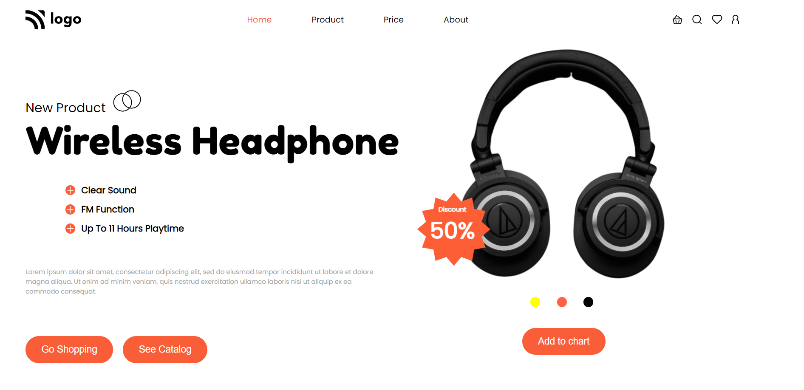

# Assignment 7

[Live Link](https://unrivaled-rugelach-375b37.netlify.app/)

- Skills Gained

  - Learned how we can use position Relative & Absolute.

---

## Time taken to finish this project

- 3 hour to complete it.

#### Screenshot

